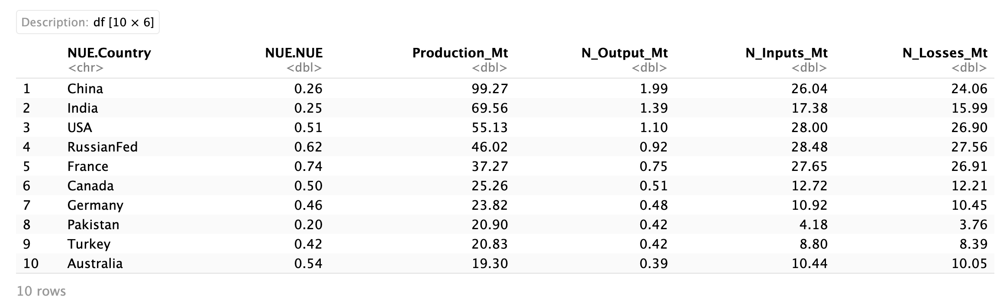

# ReSANGloW

Reproducible Spatial Analysis for Charting Nitrogen Dynamics in Global Wheat Production.

## Description

This repository hosts an example of geospatial analysis and modeling tools for the Global sustainable management of agricultural resources. Leveraging techniques in spatial data science, it offers insights for land-use dynamics, crop yield modeling, and environmental impact assessment. The repository includes scripts for processing large datasets, visualizing geospatial results, and facilitating informed decision-making in agriculture and environmental science. Explore these resources to enhance your understanding of the complex interactions between land use, ecosystem dynamics, and societal objectives, or to contribute to the development of sustainable agricultural solutions.

## Getting Started

### Dependencies

-   The prerequisites, libraries, OS version, etc., needed before running the project are found in the file: "session_info.log".

### Installing

-   Clone the repo

```         
git clone https://github.com/ArturoTorres/reproducible_global_n.git
```

### Executing program

-   Run in RStudio

```         
system("quarto render global_n.qmd --to all")
```

### Visualizing Outputs

-   Beamer (check it at "global_n.pdf")

-   HTML (check it at "global_n.html")

## Top 10 Countries Wheat-Producers and Nitrogen Outputs and Losses (Task 4)

-   Using the dataset of country-level nitrogen use efficiency (NUE) of wheat from [@zhang_managing_2015], and steps from previous tasks:

a.  For the 10 biggest wheat producers the country-level values of N output in harvested wheat, as well as related total N inputs and N losses (i.e., surplus) is estimated, and exported the dataset as a csv file (check it at "output/results.csv"



b.  The N outputs and losses for these 10 countries are summarized in one figure (plot exported as pdf file, check it at "output/results_N_outputs_losses.pdf")


c.  The main patterns of N losses across countries, in relation to production volume and NUE (including any singular feature) are explained in the following paragraph:

-   In the analysis of the top 10 wheat-producing countries, varying patterns of nitrogen losses is observed. Some countries with high wheat production volumes and relatively low NUE, such as China, showed significant nitrogen losses, suggesting inefficiencies in nitrogen utilization. In contrast, countries with relative higher NUE, like Australia, exhibited lower losses despite high production. Additionally, a few countries, like France, displayed unexpected patterns of high losses compared to their NUE, potentially indicating other factors influencing nitrogen loss, such as agricultural practices or environmental conditions.

## Integration within the BNR's Modeling Suite (Task 5)

In the following paragraph is explained how an analysis like the one performed in previous tasks could translate to the models within BNR's modeling suite (https://iiasa.github.io/iBIOM/en/main/), including potential limitations.

-   An analysis of nitrogen output, inputs, and losses in wheat production can inform IIASA BNR's modeling suite by providing critical data inputs for assessing the environmental impacts of agricultural practices. These data help in calibrating and validating models related to land use, nutrient management, and climate change mitigation, enhancing the suite's accuracy in predicting the effects of different agricultural scenarios on nitrogen cycling and environmental sustainability. Limitations, however, may arise from the simplifications made e.g. in assuming a fixed 2% nitrogen content in harvested yield, as actual values can vary. Additionally, model outcomes depend on the quality and comprehensiveness of input data, which can pose challenges in areas with limited data availability.

## Issues and Assumptions

### Issues

-   In the Task 2, an implementation of the country-level aggregation step for computing the Global wheat production per country in parallel was needed due to the high computational burden reached and avoid RAM issues. Therefore, parallel pre-computed RData objects were created to be loaded in this step to render this reproducible presentation in a reasonable short time (less than one minute), i.e.

    -   "./data/sp_join_lst.RData"

    -   "./output/raster_lst.RData"

    -   "./output/country_aggregated_production_lst.RData"

-   Similarly in Task 3 the actual computation of the Global country production was coded in parallel and saved as an RData object to be loaded subsequently, i.e.

    -   "./output/country_aggregated_N_lst.RData"

### Assumptions

-   The computations were done by using the Geodetic CRS: WGS 84.

-   The three input maps from the SPAM model for the year 2005 are global scale in raster format (5 arcminute spatial resolution):

    -   Estimates of yield in Kg/Ha,
    -   Physical area in Ha,
    -   Harvested area in Ha.

-   1 ton is equal to 1,000 Kg, so 1 million ton is equal to 1,000,000,000 Kg, i.e. 1 million ton = 1e9 Kg.

## Authors

Contributors names and contact info

Arturo Torres (jatorresma1\@gmail.com)\
[\@ArturoTorres](https://arturotorres.github.io)

## Version History

-   v0.2
    -   Various bug fixes, additions and optimizations
    -   See [commit change]() or See [release history]()
-   v0.1
    -   Initial Release

## References

-   Ulrike Wood-Sichra, Alison B Joglekar, and Liangzhi You. Spatial Production Allocation Model (SPAM) 2005: Technical Documentation. 2016.
-   Xin Zhang, Eric A. Davidson, Denise L. Mauzerall, Timothy D. Searchinger, Patrice Dumas, and Ye Shen. Managing nitrogen for sustainable development. Nature, 528 (7580):51--59, December 2015. ISSN 0028-0836, 1476-4687. doi: 10.1038/nature15743. URL https://www.nature.com/articles/nature15743.
